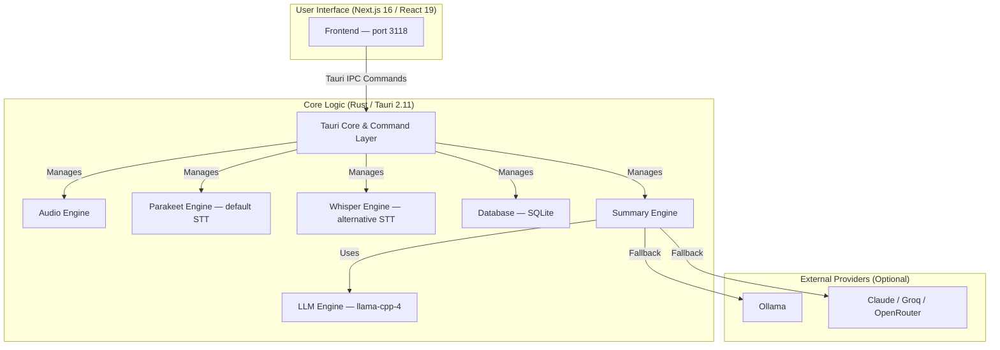

# System Architecture

Twin is a self-contained desktop application built with [Tauri](https://tauri.app/). It combines a Rust-based backend with a Next.js frontend into a single, efficient, and cross-platform application.

## Tech Stack

| Layer | Technology |
|-------|------------|
| Desktop Shell | Tauri 2.11.5 (Rust) |
| Frontend | Next.js 16, React 19, TypeScript |
| Speech-to-Text | Whisper (whisper-rs 0.16), Parakeet (ONNX via ort 2.0.0-rc.10) |
| LLM Inference | llama-cpp-4 0.3 (local GGUF models) |
| External LLMs | Ollama, Claude, Groq, OpenRouter, OpenAI-compatible |
| Database | SQLite (via sqlx 0.8) |
| GPU Acceleration | CUDA, Metal, Vulkan, CoreML, HIP |

## High-Level Architecture Diagram

## Component Details

### Frontend (Next.js 16 / React 19)

- Provides the user interface for managing meetings, displaying transcriptions, and configuring the application.
- Runs on port 3118 (dev) or exported static build (production).
- Communicates with the Rust core through Tauri's command system (`invoke`) and event system (`listen`).
- Uses `react-resizable-panels` for sidebar/content layout, virtualized rendering for large transcripts.
- State management via React Context (ConfigContext, OnboardingContext, RecordingStateContext, TranscriptContext).

### Backend (Rust Core)

- **Tauri Core:** Manages the window, handles events, single-instance enforcement, tray icon, and exposes Rust functionality to the frontend via `#[tauri::command]` handlers.

- **Audio Engine** (`audio/`): Captures audio from microphone and system, performs mixing, voice activity detection (VAD), and orchestrates recording workflows. Supports macOS (ScreenCaptureKit), Windows (WASAPI), and Linux (ALSA/PulseAudio).

- **Parakeet Engine** (`parakeet_engine/`): Default speech-to-text engine using NVIDIA's Parakeet ONNX models (e.g., `parakeet-tdt-0.6b-v3-int8`). Fast, accurate, runs via ONNX Runtime (`ort` crate).

- **Whisper Engine** (`whisper_engine/`): Alternative STT using OpenAI's Whisper via `whisper-rs`. Supports GPU acceleration (Metal, CUDA, Vulkan).

- **LLM Engine** (`llm_engine/`): Local LLM inference using `llama-cpp-4` for GGUF models. Supports GPU acceleration per platform (Metal on macOS, CUDA/Vulkan on Windows/Linux).

- **Summary Engine** (`summary/`): Orchestrates meeting summary generation using multiple LLM providers — local (llama-cpp-4), Ollama, Claude, Groq, OpenRouter, or any OpenAI-compatible endpoint. Includes template system, language detection, and caching.

- **Database** (`database/`): SQLite persistence via `sqlx`. Stores meetings, transcripts, summaries, speakers, action items, meeting notes, settings, and FTS5 full-text search index. Uses WAL mode with automatic corruption recovery.

- **API Layer** (`api/`): Tauri command handlers that bridge frontend requests to backend repositories and services.

### External Integrations (Optional)

- **Ollama**: Local LLM discovery and inference (auto-detects available models).
- **Claude / Groq / OpenRouter**: Cloud LLM providers for summary generation when local models aren't suitable.
- **OpenAI-compatible endpoints**: Custom base URL support for self-hosted or compatible APIs.

## Data Flow

1. **Recording**: User starts recording → Audio Engine captures mic + system audio → VAD filters speech segments → Parakeet (or Whisper) transcribes in real-time → transcripts stream to frontend via Tauri events.
2. **Summary**: User requests summary → Summary Engine loads transcript chunks → selects LLM provider → generates summary → persists result to Database → emits completion event to frontend.
3. **Persistence**: All meetings, transcripts, summaries, speakers, action items, and notes are stored in SQLite. Database path resolved cross-platform via Tauri path APIs.
